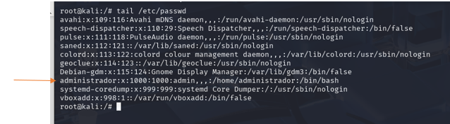

Nesta práctica utilizarase una máquina Debian 12.10 na que se creará o usuario “administrador” con contraseña “abc123.”. Posteriormente, sobre esta máquina introduciremos e iniciaremos unha imaxe Live de Kali Linux, que se usará para montar os ficheiros raíz do Debian, por medio de “chroot”,  e “recuperarase” o contrasinal do usuario de Debian.  

# Instalación da máquina Debian  


Unha vez instalado o sistema Debian, apagaremos a máquina e insertarase como unha unidade óptica a ISO Live de Kali:  

  

  

  

# Inicio con Kali  

Ahora volveremos a arrancar a máquina e, se non se inicia automáticamente o Kali, xusto cando se arranque a máquina virtual pulsaremos F12 e escolleremos a opción arrancar dende o CD-ROM.  

  

  

Iniciamos dende o instalador de Kali, xa que arranca un Live.  

Poñenos a distribución do teclado en castelán 

```bash
setxkbmap es
```

Iniciamos sesión como root “sudo su \-”  

Executamos “mount” ou “df \-Th” para ver que discos están conectados ao equipo.  

Facemos “ls /dev” para buscar os dispositivos conectados ao equipo e buscamos os “sdX”, que serán os discos nos que estaba instalado o Debian sobre o que estamos correndo o live de Kali, neste caso sabemos que está instalado no disco **sda**.  


Usaremos “CHROOT” para modificar o directorio raíz do live do kali para cargar o sistema de ficheiros do Debian (/dev/sda), e para eso imos crear unh directorio na ruta onde imos montar a información 

```bash
mkdir /mnt/recuperar && ls -ld /mnt/recuperar
```  

Despois montamos o disco dev/sda1 en /mnt/recuperar  

  


Ahora vemos que temos a raíz do debian en /mnt/recuperar  

Para poder usar como raíz o directorio /recuperar, precisamos montar os directorios “**/proc**”, “**/sys**” e ”**/dev**” do Kali dentro da carpeta /recuperar. Facendo o proceso de montaxe.  

  

Ahora usamos o comando  

```bash
chroot /mnt/recuperar /bin/bash
```

  

Podemos comprobar que os ficheiros nos que estamos son os do Debian, vendo, por exemplo os usuarios do ficheiro /etc/passwd  
  
Vendo que somos root en Debian, podendo cambiarlle a contraseña ao usuario do debian:  

antes “abc123.” e ahora “ABC123.”  

  

Ahora volvemos a arrancar o Debian, quitando o disco do Kali para que arranque Debian.  

Ahora para iniciar sesión en debian teremos que poñer a contraseña que cambiamos dende o Kali.  


