Vamos a llevar a cabo la configuración de una pequeña red con dos máquinas.

Pasos de la tarea

1\. Crea dos máquinas virtuales (mediante clonación enlazada y reinicializando las direcciones MAC). Al hacerlo, los equipos serán visibles a través del interfaz de red enp0s8 (segundo adaptador de red virtual que implementa en VirtualBox una conexión de red interna a la red “FUHW”).

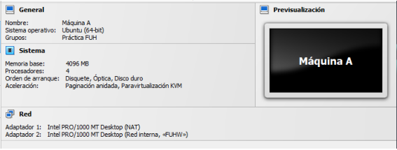
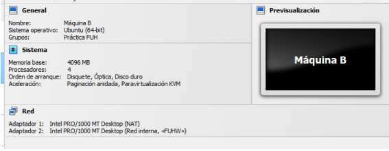
2\. Configura las interfaces de red enp0s8 de ambos equipos de forma que estén en la red IP 192.168.100.0/24 de forma no permanente. Usa la segunda y tercera ip de host disponible de esta red respectivamente. En esta la red interna “FUHW” VirtualBox se considerará que no existe DHCP y se usará, por tanto, una configuración estática.

Conf MV1:  
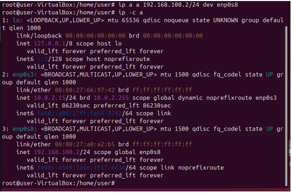
Conf MV2:  
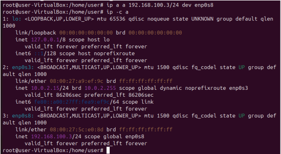
3\. Comprueba que los que los equipos se pueden ver usando ping.

MV1 🡪 MV2  
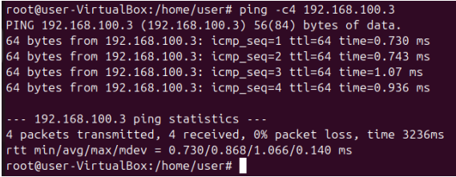
MV2 🡪 MV1    
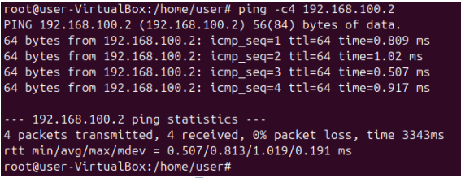  
4\. Ahora haz que la configuración de ambas redes sea persistente, máquina A mediante netplan y máquina B mediante NetworkManager.

MV1 Con Netplan

Se hace una copia del fichero /etc/netplan/01\*.yaml para la tarjeta de red enp0s8

Llamando al nuevo archivo 02-enp0s8.yaml, y escribiendo las siguientes líneas dentro de él.

  ethernets:

    enp0s8:

      dhcp4: false

      addresses:

      \- 192.168.100.2/24

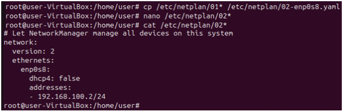
Posteriormente se ejecuta el comando “netplan apply” y la configuración se aplicará y ya será persistente.

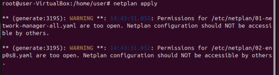
MV2 Con NetworkManager

Primero configuraremos NetworkManager para que esté activado y cargue su configuración, cambiando, dentro del archivo “/etc/NetworkManager/NetworkManager.conf” la línea

“managed=false” >> “managed=true”

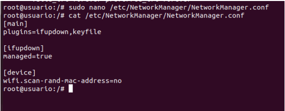
Posteriormente creamos el archivo de configuración de la interfaz de red, en este caso enp0s8:

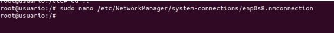

Y escribiremos las siguientes líneas:

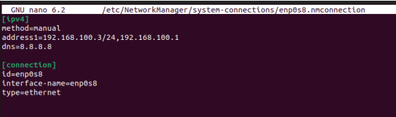

Para finalizar cambiamos los permisos del archivo para que NetworkManager aplique la configuración, ejecutamos el comando “nmcli connection up ‘enp0s8’” para que se aplique

Y comprobaremos los cambios con 
```bash
  ip  -c a
```
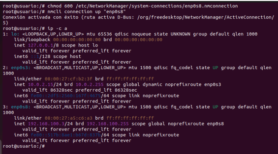