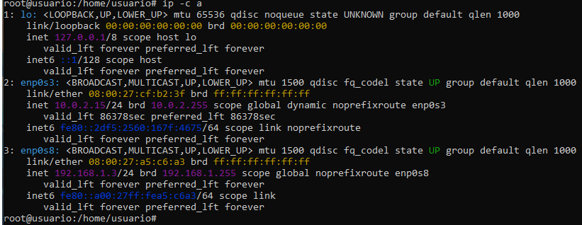
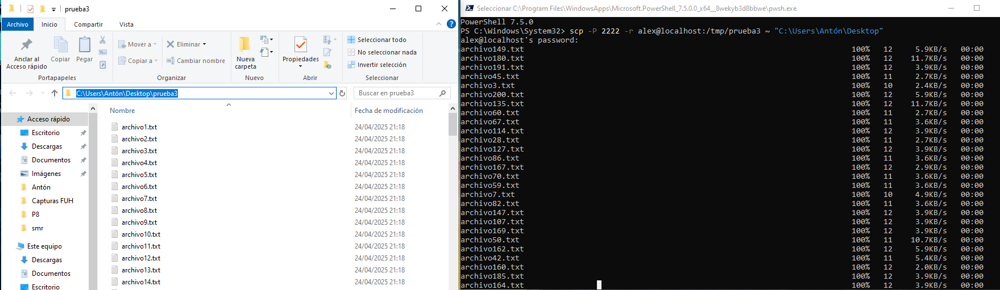

# Tarea SSH y SCP

## Crea dos máquinas virtuales y realiza el siguiente proceso.

Primero creamos las máquinas y las configuramos. Cada máquina tendrá un adaptador de red NAT “enp0s3” (para la conexión a Internet y con el anfitrión) y un adaptador de red “enp0s8” interna para conectar las máquinas entre ellas.

Podremos ver las configuraciones actuales de los adaptadores con el comando “ip \-c a”

Máquina A

Máquina B

Ahora se configurarán los adaptadores de red interna para darles una dirección IP y una máscara para que estén en la misma red y sean accesibles.

Para dar una IP y una máscara usaremos el comando

'''shell
  ip a a \[192.168.1.2/24\] dev enp0s8
'''
Pero esta configuración se perderá al reiniciar la máquina; por lo tanto, crearemos un archivo de configuración en la carpeta /etc/netplan, al que llamaremos “02-enp0s8.yaml” en el que escribiremos la configuración de la ip fija para este adaptador en cada máquina, para aplicar esta configuración ejecutaremos el comando “netplan apply”.

Yo usaré: 

- 192.168.1.2/24 Máquina A

  

- 192.168.1.3/24 Máquina B

  

* En la máquina A vamos a crear el usuario Alex y en B el usuario Brais, utilizando el comando useradd:

“useradd \-m \-d /home/alex \-s /bin/bash \-p $(openssl passwd abc123.) \-G sudo alex”

Con la máquina B se hará lo mismo, cambiando el nombre del usuario a crear por “Brais”

* Nuestra máquina A va a actuar como cliente y la máquina B como servidor.

  Para ver el estado del servicio ssh y ver si nos podemos conectar a la máquina A, podremos ejecutar el comando “systemctl status ssh” y nos pondrá información del servicio.

  

* Realiza el proceso de conexión de una máquina A hacia B explicando el comando. ¿Qué se crea cuando nos conectamos al servidor desde el cliente?

  

  Para conectarnos desde la máquina B a la máquina A con el usuario alex, ejecutaremos el comando

  “ssh brais@192.168.1.3”

  Y veremos cómo se crea una clave encriptada.

* Crea el directorio "prueba" con el archivo "prueba.txt" en la ruta temporal de A y envía la información al servidor.

  Ahora se creará en la máquina A, el archivo “prueba.txt” en la ruta /tmp/prueba

  

  Y se enviará a la máquina B mediante scp

  “scp /tmp/prueba/prueba.txt brais@192.168.1.3:\~/ ” 

  

* Crea el directorio "prueba2" con el archivo "prueba2.txt" en la ruta temporal del servidor y envíala al cliente.

  Desde el servidor creamos el directorio y el archivo. 

  

  Desde el cliente, con el comando SCP nos enviaremos el archivo que está en el servidor:

  “scp \-r brais@192.168.1.3:/tmp/prueba2 /home/alex”

  

* Transmite los directorios "prueba" y "prueba2" a tu ordenador anfitrión al escritorio.

  Desde la máquina anfitriona nos descargamos los directorios con los comandos:

  “scp \-P 2222 \-r alex@localhost:/tmp/prueba \~ "C:\\Users\\Antón\\Desktop"”

  “scp \-P 2223 \-r brais@localhost:/tmp/prueba2 \~ "C:\\Users\\Antón\\Desktop"”

  

* Crea el directorio "prueba3" con 200 archivos.txt en el servidor y transmítelo al escritorio del ordenador.

  Crearemos los archivos en la máquina A con el comando

  “for i in {1..200}; do echo "Archivo ${i}" \> archivo${i}.txt; done”

  

  Y nos la enviamos desde el anfitrión al escritorio:

  “scp \-P 2222 \-r alex@localhost:/tmp/prueba3 \~ "C:\\Users\\Antón\\Desktop"”

  

* Genera un par de claves en el cliente y haz la conexión con el servidor. Crea el passphrase \= servidorssh.

  Para generar un par de claves en la máquina B (cliente), ejecutaremos el comando  “ssh-keygen \-t rsa” y introduciremos “servidorssh” en el campo passphrase cuando se nos pregunte.

  Veremos que la ruta de guardado por defecto del par de claves será /home/brais/.ssh/id\_rsa

  

  Ahora, para enviar la clave pública a la máquina A (servidor), introduciremos el comando “ssh-copy-id \-i .ssh/id\_rsa.pub alex@192.168.1.2”

  Posteriormente, al iniciar sesión desde la máquina B en el servidor veremos que ya no pide la contraseña del usuario, sino el fingerprint que hemos introducido “servidorssh”

  

  Y comprobamos en el servidor que se ha guardado la clave pública.

  
